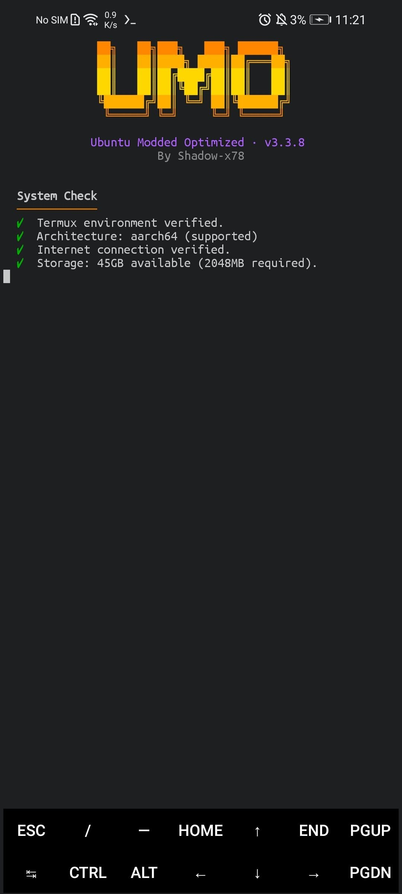
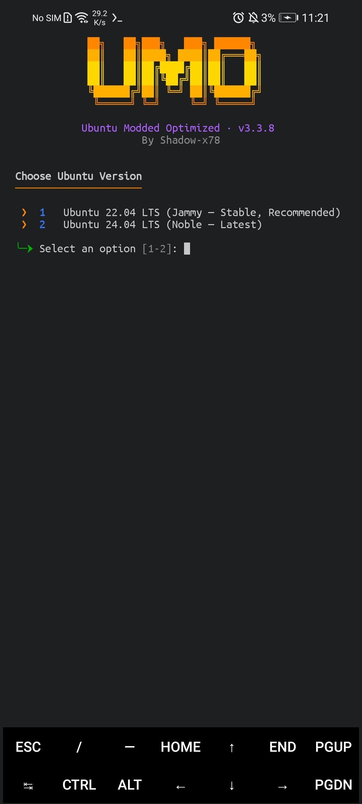
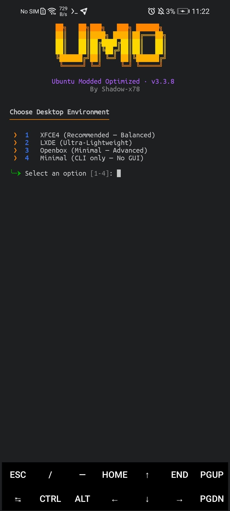
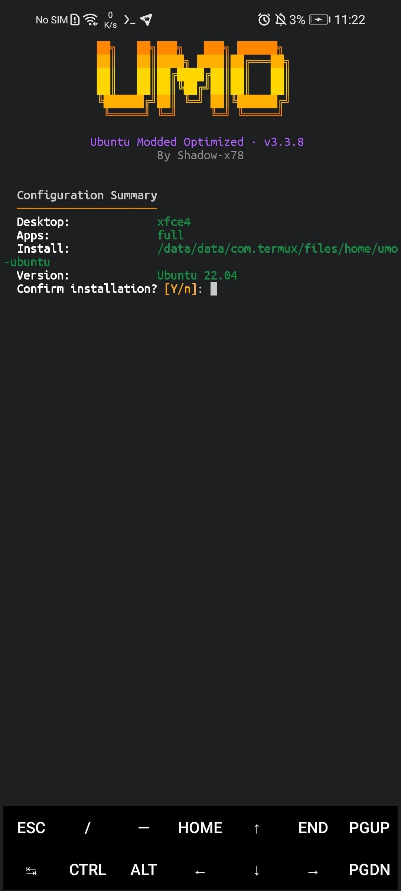
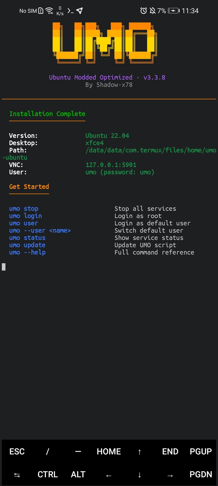

<div align="center">

<pre align="center">
 ██╗   ██╗███╗   ███╗ ██████╗
  ██║   ██║████╗ ████║██╔═══██╗
  ██║   ██║██╔████╔██║██║   ██║
  ██║   ██║██║╚██╔╝██║██║   ██║
  ╚██████╔╝██║ ╚═╝ ██║╚██████╔╝
  ╚═════╝ ╚═╝     ╚═╝ ╚═════╝
</pre>

# Ubuntu Modded Optimized

Full Ubuntu on your Android device — one command, zero hassle

[](CHANGELOG.md)
[](LICENSE)


</div>

---

## 🌐 Language

<a href="README.md">🇬🇧 English</a> · <a href="README_AR.md">🇸🇦 العربية</a>

---

## 📋 Table of Contents

- [What is UMO?](#what-is-umo)
- [Screenshots](#screenshots)
- [Desktop Environments](#desktop-environments)
- [Quick Start](#quick-start)
- [Commands](#commands)
- [CLI Options](#cli-options)
- [Requirements](#requirements)
- [Project Structure](#project-structure)
- [Documentation](#documentation)
- [Contributing](#contributing)
- [License](#license)

---

<a id="what-is-umo"></a>
## 🤔 What is UMO?

**UMO (Ubuntu Modded Optimized)** is a free, open-source Ubuntu installer for Termux — rewritten from scratch to fix the root problems found in every similar project. No external UI dependencies, no manual configuration, no surprises.

| Problem | Other Projects | UMO |
|---------|---------------|-----|
| `dialog` breaks the UI | ❌ Still using it | ✅ Pure POSIX TUI — no deps |
| VNC dies on screen lock | ❌ No fix | ✅ `termux-wake-lock` built-in |
| No audio inside proot | ❌ Manual workaround | ✅ PulseAudio TCP bridge |
| `systemctl` fails | ❌ Confusing errors | ✅ Generic shell emulator (any service) |
| 20+ manual steps | ❌ Too complex | ✅ One command: `bash install.sh` |

---

<a id="screenshots"></a>
## 🖼️ Screenshots

<p align="center">
  
  
  
  
  
</p>

---

<a id="desktop-environments"></a>
## 🖥️ Desktop Environments

| Environment | Type | Best For |
|-------------|------|----------|
| **XFCE4** | Full DE | Daily use — balanced performance |
| **LXDE** | Lightweight DE | Low-end and older devices |
| **Openbox** | Window Manager | Advanced users, minimal footprint |
| **Minimal** | CLI only | Servers and headless usage |

**Includes:** TigerVNC · PulseAudio Bridge · Termux:X11 · Generic systemctl emulator · Session Control

---

<a id="quick-start"></a>
## 🚀 Quick Start

```bash
# Clone the repository
git clone https://github.com/Shadow-x78/termux-ubuntu-umo.git ~/UMO
cd ~/UMO

# Interactive install (recommended)
bash install.sh

# Silent install with flags
bash install.sh --no-gui --de=xfce4 --apps=full

# Start Ubuntu
umo login
```

---

<a id="commands"></a>
## ⌨️ Commands

### In Termux

| Command | Description |
|---------|-------------|
| `umo start` | Start session with VNC & Audio |
| `umo stop` | Stop all services |
| `umo status` | Show running status of services |
| `umo login` | Login as root |
| `umo user` | Login as default user |
| `umo update` | Fetch and apply latest updates from GitHub |
| `umo version` | Display current UMO version |
### Inside Ubuntu

| Command | Description |
|---------|-------------|
| `umo-startvnc` | Start VNC server |
| `umo-stopvnc` | Stop VNC server |
| `systemctl start <service>` | Start a service (emulated) |
| `systemctl status <service>` | Check service status |
| `systemctl restart <service>` | Restart a service |

---

<a id="cli-options"></a>
## 🔧 CLI Options

```bash
bash install.sh [OPTIONS]

  --no-gui, --non-interactive    Skip menus, use defaults/env vars
  --de=xfce4|lxde|openbox        Choose desktop environment
  --apps=basic|dev|media|full    Application group to install
  --dir=PATH                     Custom installation directory
  --ubuntu=22.04|24.04           Ubuntu version to install
  --perf=balanced|aggressive|off Choose performance tuning level
  --theme=umo-dark|minimal|none  Choose desktop theme
  --lean                         Remove docs/man/locales to save space
```

---

<a id="requirements"></a>
## 📋 Requirements

- Android 8.0+ — ARM64 processor (aarch64)
- Termux from F-Droid or GitHub — **not** from Play Store
- 2 GB+ free storage
- Internet connection

---

<a id="project-structure"></a>
## 🏗️ Project Structure

```
UMO/
├── bin/
│   ├── umo-install          # Main installer logic
│   ├── umo-start            # Session starter (Termux-side)
│   └── umo-stop             # Session stopper (Termux-side)
├── lib/
│   ├── core-ansi.sh         # ANSI colors, logging, banners, progress
│   ├── core-ui.sh           # TUI: menus, prompts, panels
│   ├── core-system.sh       # Platform detection, storage, internet
│   ├── core-net.sh          # Downloads, mirrors, extraction
│   └── core-fs.sh           # Safe file ops, backups, templates
├── modules/
│   ├── umo-proot.sh         # Proot container setup
│   ├── umo-vnc.sh           # TigerVNC installation & session scripts
│   ├── umo-audio.sh         # PulseAudio TCP bridge
│       ├── umo-systemctl.sh     # Generic systemctl emulator
│   ├── umo-desktop.sh       # DE installer (XFCE4 / LXDE / Openbox)
│   └── umo-apps.sh          # App group installer
├── config/
│   ├── xstartup             # VNC session template
│   ├── bashrc.patch         # Shell enhancements for Ubuntu
│   └── sources.list         # Ubuntu mirror list
├── docs/
│   ├── INSTALL.md           # Detailed installation guide
│   └── TROUBLESHOOTING.md   # Common issues and fixes
├── install.sh               # Quick-start entry point
├── CHANGELOG.md             # Release history
├── LICENSE                  # MIT License
└── README.md                # This file
```

---

<a id="documentation"></a>
## 📚 Documentation

| Document | Description |
|----------|-------------|
| [INSTALL.md](docs/INSTALL.md) | Detailed installation guide |
| [TROUBLESHOOTING.md](docs/TROUBLESHOOTING.md) | Common issues and fixes |

---

<a id="contributing"></a>
## 🤝 Contributing

1. Fork the repository
2. Create a feature branch: `git checkout -b feature/my-feature`
3. Commit your changes
4. Push to the branch
5. Open a Pull Request

---

<a id="license"></a>
## 📜 License

Distributed under the [MIT License](LICENSE).

---

<div align="center">

Built by <a href="https://github.com/Shadow-x78">Shadow-x78</a> ·
[Changelog](CHANGELOG.md)

<sub>&copy; 2026 Ubuntu Modded Optimized (UMO)</sub>

</div>
